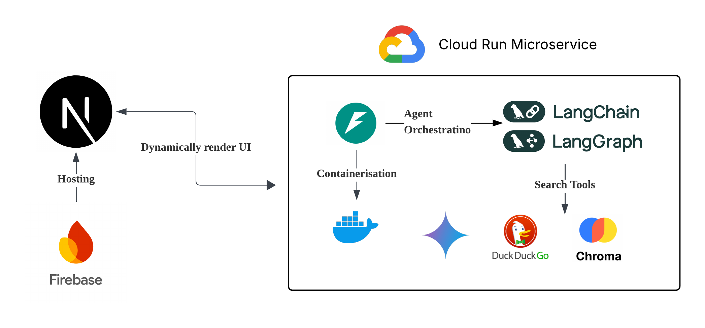
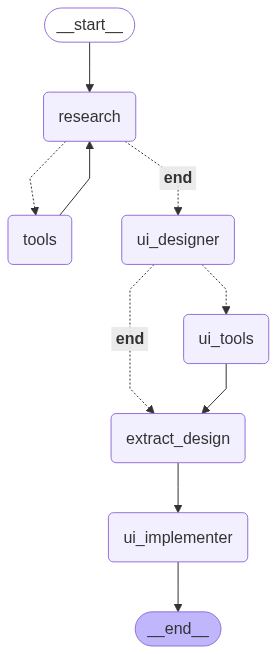
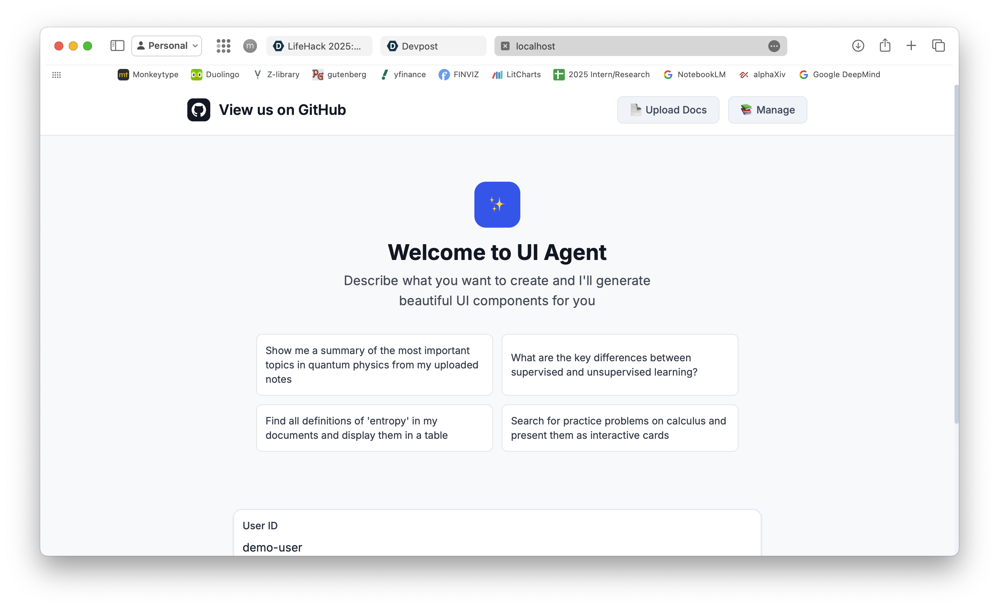
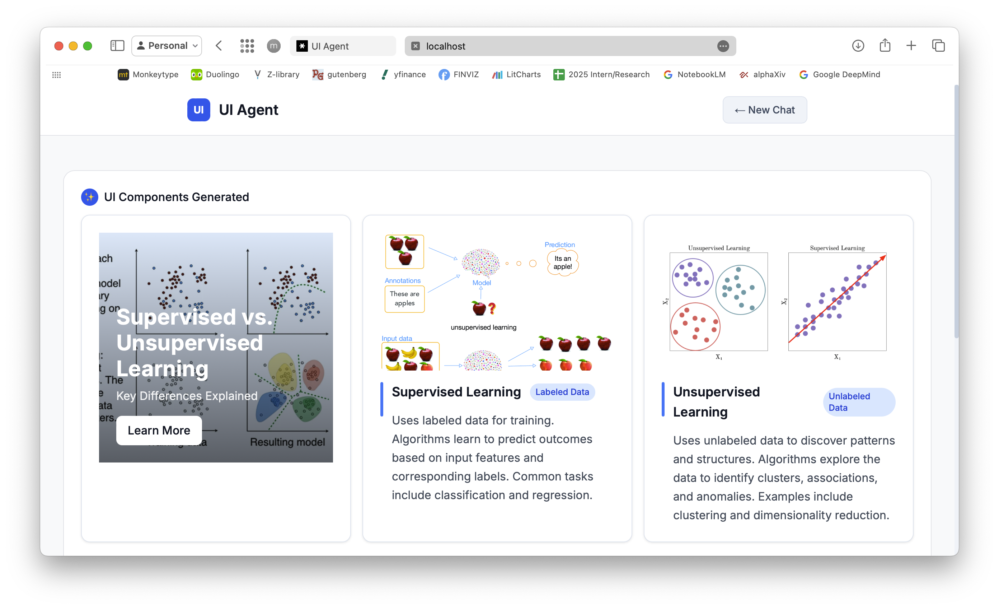

# MultiFlex

Experience AI agents that **go beyond chat — our platform lets AI generate dynamic, visual interfaces tailored** to your question. We want to challenge how search and information is traditionally presented in AI systems. Instead of just text, the AI can present answers as cards, tables, galleries, or custom layouts, choosing the best format for each context.

With advanced multimodal capabilities, RAG, searches, and real-time image generation, the system delivers responses enriched with images, structured data, and interactive elements—making complex topics clearer and learning more engaging.

> Try it out now at [this link](https://multiflex-75bba-1cadf.web.app/)! View us on [devpost](https://devpost.com/software/multiflex?ref_content=my-projects-tab&ref_feature=my_projects) and our [demo video](https://youtu.be/Nu0qq5zvanM)

**Key Features:**

- Ask questions naturally about your documents or any topic, even the latest news
- Get personalized, visually rich answers by uploading PDF, PPTX, DOCX, and image files
- Interact with custom UIs—cards, tables, galleries, and more

**Examples:**

- Visual summaries of your notes
- Practice problems as interactive cards
- Side-by-side comparisons in tables
- Sortable lists of definitions from your files

## Architecture

Our full stack multi-agent application leverages cloud technologies for scalability and performance and cutting edge AI models like Gemini and Imagen for advanced language and multimodal capabilities.



## Multi-Agent System

Our multi-agent architecture is orchestrated using LangGraph:

<p align="center">
   
</p>

### Research Agent

- **Purpose**: Gathers comprehensive information from multiple sources
- **Tools**: RAG search, web search, image search
- **LLM**: Gemini 2.0 Flash for research planning and synthesis
- **Output**: Consolidated knowledge base with documents, search results, and images

### UI Designer Agent

- **Purpose**: Creates interactive UI specifications based on research findings
- **Tools**: UI image search, Imagen generation for custom visuals
- **LLM**: Gemini 2.0 Flash (high creativity) for UI design
- **Output**: Dynamic UI components with embedded content and generated images

### LangGraph Orchestrator

- **Purpose**: Coordinates agent workflow and state management
- **Features**: Tool condition routing, state persistence, iteration control
- **Flow**: Research → UI Design → Response Generation

## Demo Photos

<p align="center">
   
   
</p>

## Technology Stack

### Backend

- **Framework**: FastAPI with Uvicorn
- **AI/ML**: LangChain, LangGraph, Google Gemini 2.0 Flash
- **Vector Database**: ChromaDB with Google Embeddings
- **Search**: DuckDuckGo Search API
- **Image Generation**: Google Imagen
- **Document Processing**: Unstructured, PyPDF, python-docx

### Frontend

- **Framework**: Next.js 14 with TypeScript
- **Styling**: Tailwind CSS
- **Components**: Custom dynamic UI renderers
- **Build**: Static export for Firebase Hosting

### Infrastructure

- **Backend Hosting**: Google Cloud Run (serverless)
- **Frontend Hosting**: Firebase Hosting
- **CI/CD**: Google Cloud Build
- **Storage**: Google Cloud Storage (optional)

## For Developers

### Project Structure

```
nus-hacks/
├── backend/                     # Python FastAPI backend
│   ├── src/
│   │   ├── main.py             # FastAPI application
│   │   ├── agent.py            # LangGraph multi-agent workflow
│   │   ├── tools.py            # Research and UI generation tools
│   │   ├── rag_manager.py      # ChromaDB RAG implementation
│   │   └── upload.py           # Document upload handling
│   ├── vectorstore_data/       # ChromaDB persistence
│   ├── requirements.txt        # Python dependencies
│   ├── Dockerfile             # Container configuration
│   └── .env.example           # Environment template
│
├── frontend/                   # Next.js TypeScript frontend
│   ├── src/
│   │   ├── app/               # Next.js App Router
│   │   │   ├── page.tsx       # Main chat interface
│   │   │   ├── result/        # Response display page
│   │   │   ├── upload/        # Document upload page
│   │   │   └── manage/        # Document management
│   │   └── components/        # Dynamic UI components
│   │       ├── Card.tsx       # Content cards
│   │       ├── Gallery.tsx    # Image galleries
│   │       ├── Hero.tsx       # Hero sections
│   │       ├── List.tsx       # Interactive lists
│   │       ├── Stats.tsx      # Data displays
│   │       └── Testimonial.tsx # Quote blocks
│   ├── package.json           # Node.js dependencies
│   └── firebase.json          # Firebase configuration
│
├── cloudbuild.yaml            # Google Cloud Build configuration
└── README.md                  # This file
```

### Local Setup

#### Prerequisites

- **Node.js 18+** and npm
- **Python 3.11+** and pip
- **Google API Key** (for Gemini and embeddings)
- **Git** for version control

#### Backend Setup

1. **Navigate to backend directory**:

   ```bash
   cd backend
   ```

2. **Create and activate virtual environment**:

   ```bash
   python -m venv venv
   source venv/bin/activate  # On Windows: venv\Scripts\activate
   ```

3. **Install dependencies**:

   ```bash
   pip install -r requirements.txt
   ```

4. **Configure environment**:

   ```bash
   cp .env.example .env
   ```

   Edit `.env` with your credentials:

   ```env
   GOOGLE_API_KEY=your_google_api_key_here
   CORS_ORIGINS=http://localhost:3000,http://127.0.0.1:3000
   ```

5. **Run the backend server**:

   ```bash
   # From the backend directory
   python -m src.main

   # Or using uvicorn directly (recommended)
   uvicorn src.main:app --host 0.0.0.0 --port 8000 --reload
   ```

   Backend will be available at `http://localhost:8000`

#### Frontend Setup

1. **Navigate to frontend directory**:

   ```bash
   cd frontend
   ```

2. **Install dependencies**:

   ```bash
   npm install
   ```

3. **Configure environment** (create `.env.local`):

   ```env
   NEXT_PUBLIC_API_URL=http://localhost:8000
   ```

4. **Run development server**:

   ```bash
   npm run dev
   ```

   Frontend will be available at `http://localhost:3000`

#### Development Workflow

1. **Start both servers** in separate terminals
2. **Upload documents** via the Upload page (`/upload`)
3. **Test queries** using the main interface
4. **View dynamic responses** on the Results page (`/result`)
5. **Manage documents** via the Management page (`/manage`)

#### API Testing

Test the backend directly:

```bash
curl -X POST "http://localhost:8000/api/agent" \
  -H "Content-Type: application/json" \
  -d '{"prompt": "Explain quantum physics", "user_id": "test-user"}'
```

### API Documentation

#### POST `/api/agent`

Process user queries and generate dynamic UI responses.

**Request:**

```json
{
  "prompt": "Explain machine learning concepts from my notes",
  "user_id": "student-123"
}
```

**Response:**

```json
{
  "ui_type": "card_list",
  "data": [...],
  "images": [...],
  "generated_images": {...}
}
```

#### POST `/api/upload`

Upload documents for RAG processing.

**Request:** Multipart form with file upload

**Response:**

```json
{
  "message": "Documents processed successfully",
  "file_count": 3
}
```

---

Built with ❤️ for educational AI applications. This project demonstrates advanced RAG techniques, multi-agent AI workflows, and dynamic UI generation for personalized learning experiences.
